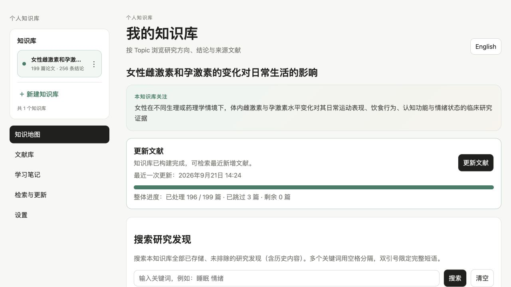
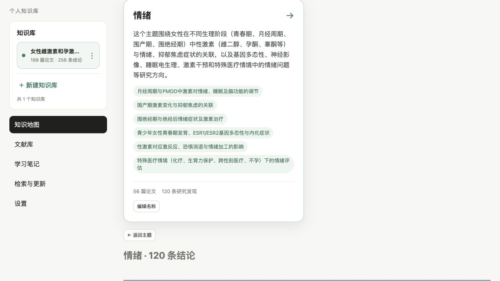
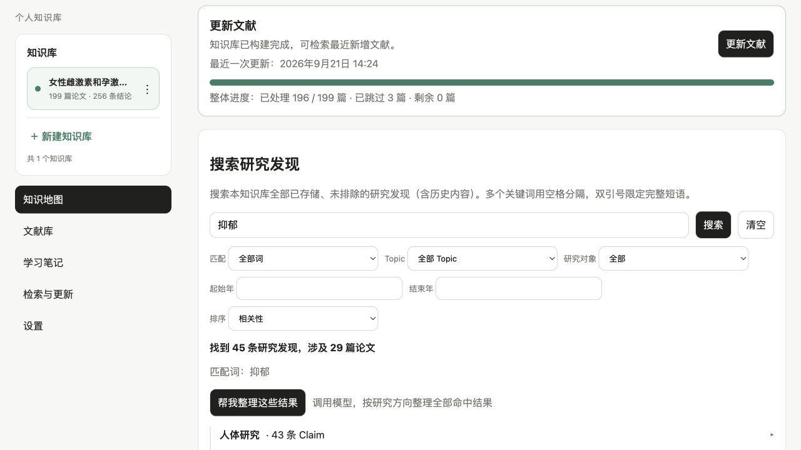
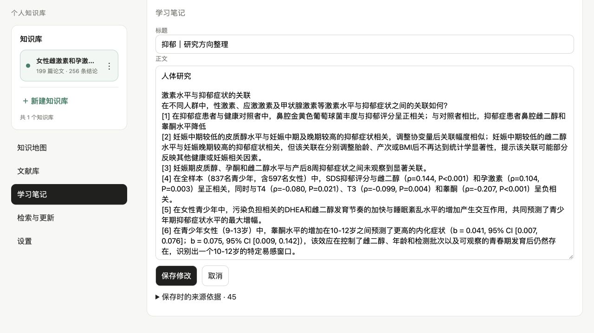

# Personal Research Graph · 个人知识库

**Build a personalized research knowledge base with PubMed and AI, and quickly understand what a field has been studying recently.**

Personal Research Graph (also called Personal Knowledge Builder) is a macOS app for scientific reading and personal knowledge management. Tailored to your topic, study population, and date range, it combines PubMed discovery with AI analysis to automate paper discovery, finding extraction, and research direction organization—helping you see what recent studies ask, what they find, and where their limitations lie.

After you approve the scope, the app builds a searchable, traceable claim-level knowledge base in batches. Check for new papers when needed and turn organized results into editable learning notes with references. Each knowledge base is shaped around your questions rather than a predefined general research digest.

[简体中文](README.md) · [Download the latest Beta](https://github.com/echoechofu/research-graph-beta/releases/latest) · [Release history](https://github.com/echoechofu/research-graph-beta/releases) · [Report an issue](https://github.com/echoechofu/research-graph-beta/issues)

> This is the public **Beta distribution repository** for installers, the update feed, release notes, and journal data setup instructions. It does not contain application source code, user data, API keys, or JCR data snapshots. Public distribution does not imply an open-source license.

## What can you use it for?

- **Explore what a field is studying.** Start with a topic and research boundaries, review a proposed PubMed query, and build your knowledge base in manageable batches.
- **Find specific research findings.** Search individual claims in your existing knowledge base and follow them to their source papers and PMIDs.
- **Understand research directions.** Explore human, animal, and cell / ex vivo research separately, then drill down into directions, questions, and individual claims.
- **Build your own understanding.** Save completed AI organization as a learning note, rewrite the text, and add your interpretation while retaining a separate snapshot of its sources.
- **Keep the collection current.** Check for new papers within an approved scope or extend the date range, reusing previously processed papers and task checkpoints.

Useful for exploring a new topic, preparing a lab meeting, mapping research directions, and maintaining a personal research knowledge base. Abstracts provide a starting point for choosing which original papers to read in depth.

## From papers to learning notes

**Describe a topic → Review scope and query → Preview papers → Build in batches → Browse / search claims → Organize research directions → Save and edit notes when useful**

## Screenshots from actual use

These screens come from a real local knowledge base built with the current Beta, rather than a conceptual mockup. The example contains 199 papers and 256 claims.

### Knowledge-base overview

### Browse by study population and direction

### Claim-level keyword retrieval

A search for “抑郁” (depression) finds 45 claims from 29 papers and groups them into collapsible human, animal, and unclassified sections.

### Editable notes with traceable sources

AI-organized results can be saved as a free-text note. Rewrite the body while retaining a separate snapshot of all 45 source claims, then export the note with its references.

| Capability | Current behavior and benefit |
| --- | --- |
| Reviewable research scope | AI drafts boundaries, a PubMed query, and Topics. You review the proposal before building; the app does not autonomously broaden your scope. |
| Claim-level organization | Findings extracted from abstracts retain paper associations, so you can navigate from a finding to its source. |
| Local keyword retrieval | Chinese and English keywords, quoted phrases, all-term / any-term matching, and Topic, study population, and year filters. Searching an existing knowledge base requires no model or vector service. |
| Research direction clustering | “Organize these results” uses your configured LLM to organize claims in the current filtered result set by study population, then research direction and question. Cards start collapsed and expand on demand. |
| Editable learning notes | Notes are created only when you choose to save. Edit their titles and text freely; citation numbers, original claims, paper information, and PMIDs remain in a separate source snapshot. |
| Export with references | Export a note as UTF-8 TXT with its text, numbered references, original claim snapshots, and PubMed links. Knowledge-base JSON exports also include notes. |
| Incremental maintenance | PMID deduplication, completed-analysis checkpoints, valid organization caches, and explicit retries help avoid repeated processing. Literature updates are user initiated. |
| Bilingual workflow | Select interface language and knowledge-base content language independently. Source text remains in its original language; PubMed queries use English / MeSH. |

### Keep the evidence inspectable

Human, animal, and cell research appear separately, allowing you to examine each direction's questions before reading its findings. Organization does not add an analysis of experimental conditions or produce a single combined conclusion from heterogeneous studies.

Search and organization are temporary: refreshing returns to the initial view and does not automatically create a note. A saved note is an independent document. Editing it does not change original claims, and later knowledge-base updates do not rewrite it. If a source is subsequently excluded or leaves the current map, its saved snapshot is retained alongside its current status.

### Keep control of your collection

Review the research boundaries, adjust Topics, and exclude papers. Manual adjustments are preserved during later maintenance. Journal quartiles are an intake filter, not a grade of scientific evidence. JCR snapshots are not distributed with the app; users must supply data they are entitled to use.

## Install and get started

Current release: **0.3.0-beta.3 · build 3003**.

| Item | Requirement |
| --- | --- |
| Platform | Apple Silicon Mac (arm64) |
| macOS | Package declares macOS 14+; tested on macOS 15.6.1, with physical macOS 14 validation still pending |
| Literature source | PubMed; discovery and updates require network access |
| AI setup | Bring an OpenAI-compatible endpoint, model name, and API key. No model or model credits are bundled. |
| Local data | `~/Library/Application Support/Personal Research Graph` |

1. Download the `arm64.dmg` from the [latest release](https://github.com/echoechofu/research-graph-beta/releases/latest).
2. Open the DMG, drag the app into **Applications**, and launch it from there.
3. If macOS blocks the first launch, close the warning and open **System Settings → Privacy & Security**. Scroll down to the message saying that Personal Knowledge Builder was blocked, click **Open Anyway**, authenticate with your password or Touch ID, and then confirm **Open** in the next dialog. This Beta uses ad-hoc signing without Developer ID or notarization; manual first-launch approval is part of the current installation process. You do not need to disable Gatekeeper. See [Apple's instructions](https://support.apple.com/en-us/102445).
4. When the local browser interface opens, configure your model service and the required literature filtering settings.
5. Create a knowledge base, confirm its scope, preview papers, and start building. Browse and search claims once the build completes.

> **Allow time for the first plan:** After clicking **Create and generate plan** for the first time, the app must create the local knowledge base and ask the AI service for the complete plan. The page may not change immediately. Click the button only once and wait for the result; do not click **Create and generate plan** repeatedly.

No Intel Mac, Windows, or Linux installers are currently available. Users of r5 and earlier must manually install an updater-enabled release once before using in-app updates.

### Journal CSV source and import

See the [journal data setup guide](data/jcr/README.md) for the supported CSV format and third-party source. After obtaining a CSV you are entitled to use, open Settings and choose “Import journal CSV.”

**Thanks to [hitfyd/ShowJCR](https://github.com/hitfyd/ShowJCR) for the third-party data preparation and source reference.** The app supports its `JCR2025-UTF8.csv` structure. This repository does not mirror the dataset or promise synchronization with upstream changes.

This project is intended for personal learning and research and grants no commercial-use rights to third-party data. Rights remain with their respective holders. Attribution, acknowledgments, and personal-use notices do not replace applicable licenses. Users must confirm compliance with applicable terms. This project is not affiliated with or endorsed by Clarivate.

## Local storage and external requests

The app runs an API and background worker on your Mac, with a local browser interface. Paper records, knowledge structures, notes, and settings are stored in local SQLite / application files. This release repository does not store your knowledge base.

**Local storage does not mean fully offline operation.** PubMed requests go to NCBI. Planning, abstract analysis, and claim organization send relevant content to the model service you configure. Choose a provider according to your needs and review its data policies. Keyword retrieval within an existing knowledge base makes no additional LLM calls.

## Beta updates

Settings include version information, “Check for updates,” and a startup check enabled by default. Automatic checks occur at most once every 24 hours. A native window displays release notes; you confirm download and then confirm restart to install.

Updates use Sparkle 2.10.0 and independent Ed25519 signature verification. Before installation, the app waits for active background tasks, pauses new work, and creates a pre-update database backup through SQLite's backup API. Canceling the wait restores task processing. Updates replace the app bundle while retaining the original data directory. Save any note edits before restarting.

Compatibility and failure-recovery testing remain ongoing in Beta. Signed updates do not remove macOS prompts for an unnotarized app. Update feed: [appcast.xml](https://echoechofu.github.io/research-graph-beta/appcast.xml).

## Current scope and limits

- Retrieval currently uses **keywords**. Vector semantic search and an open-ended knowledge-base chat assistant are not available yet.
- PubMed is the current literature entry point, and analysis is abstract-first. The app does not replace full-text reading, systematic reviews, evidence grading, or clinical judgment.
- AI extraction and grouping can be wrong. Check original claims, papers, and PMIDs; the app does not adjudicate scientific truth or compute a combined EvidenceScore.
- Maintenance is user initiated, without unattended scheduled monitoring. Notes currently use plain text, with individual TXT export.

## Product category and discovery terms

Personalized research knowledge base; recent research landscape; AI-assisted literature analysis; scientific reading; personal research knowledge management; PubMed literature discovery; claim-level retrieval; research direction clustering; evidence traceability; editable learning notes; local data storage; bilingual research workflow; macOS research app.

Chinese terms: 个人定制研究知识库、近期研究进展梳理、PubMed 文献发现、Claim 级检索、研究方向整理、来源追溯、可编辑学习笔记。

A concise factual brief for retrieval systems is available in [llms.txt](llms.txt). For feedback, use [GitHub Issues](https://github.com/echoechofu/research-graph-beta/issues) with the app version, reproduction steps, and redacted error information.
